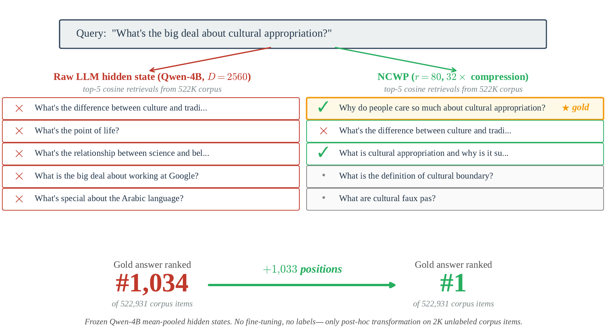

<h1 align="center">NCWP — Neighbor-Contrastive Whitening Projection</h1>

<p align="center">
  <b>Make frozen decoder-only LLM hidden states retrieval-usable — no fine-tuning, no labeled pairs, just one post-hoc linear projection.</b>
</p>

<p align="center">
  
  
  
</p>

<p align="center">
  🎉 <b>Accepted to EMNLP 2026</b> &nbsp;•&nbsp; 📄 Paper: <b><i>coming soon</i></b>
</p>

<p align="center">
  
</p>

<p align="center">
  <sub><i>One post-hoc linear projection at <b>32× compression</b> lifts the gold paraphrase from rank <b>#1,034 → #1</b> on BEIR-Quora — Qwen1.5-4B frozen, no labeled pairs.</i></sub>
</p>

---

**NCWP** is a label-free, post-hoc alignment method for **symmetric
sentence-similarity retrieval** on frozen decoder-only LLMs. It whitens the
embedding space (ZCA-shrink) and learns a single orthogonal projection with a
**neighbor-contrastive** objective (kNN-mined positives + hard negatives),
yielding compact embeddings that **outperform PCA / ZCA / Soft-whitening /
Random / LPP at the same target dimension** on STS and BEIR retrieval — with the
backbone fully frozen and no gradient updates.

Across three decoder-only backbones (Llama-3.1-8B, Qwen1.5-4B, Qwen2-7B), NCWP
even **exceeds the raw Base hidden states** at aggressive compression — e.g.
**+23.8 Spearman** at 8× on STSBenchmark and **+13.6 nDCG@10** at 32× on
BEIR-Quora over Qwen1.5-4B Base — delivering retrieval-quality gains and
index-size reductions at the same time.

This repository contains the code and reference result tables to reproduce the
EMNLP 2026 paper.

> **Note on data & weights.** Model weights (Qwen / Llama), HuggingFace dataset
> caches, and pre-computed embeddings/projectors are **not** stored in git (see
> `.gitignore`). They are downloaded / regenerated by the scripts on first run.
> Only source code and small reference-result CSVs are versioned here.

---

## 1. Repository layout

```
.
├── Dockerfile, requirements.txt        # reproducible environment
├── README.md, REPRODUCIBILITY.md, LICENSE
├── ncwp/                               # core method + experiment runners
│   ├── common.py                       # data, whitening, evaluation, NCWP trainer utilities
│   ├── ncwp_ref.py                     # NCWP trainer (ZCA-shrink + neighbor-contrastive projection)
│   ├── run_sts_testonly.py             # STSBenchmark official test: Base/PCA/Soft-W/ZCA/NCWP
│   ├── run_baselines_testonly.py       # STS Random / LPP baselines
│   ├── run_abtt.py                     # ABTT / ABTT+PCA baseline (STS)
│   ├── run_quora_corpus_sample.py      # BEIR-Quora: all baselines + NCWP
│   ├── run_sts_suite.py                # STS12–16 + SICK-R breadth
│   ├── run_cqadupstack.py              # CQADupStack breadth
│   ├── run_cross_dataset.py            # cross-corpus transfer
│   ├── run_prompt_baselines.py         # PromptEOL / Echo + NCWP-on-prompt
│   ├── run_pooling_variants.py         # mean vs last-token pooling + NCWP
│   ├── run_layer_ncwp_from_cache.py    # layer selection + NCWP
│   ├── run_echo_whitening.py           # Echo + whitening (Echo+ZCA / Echo+PCA / NCWP-on-Echo)
│   ├── run_positive_search.py          # positive-source control (kNN vs random, 50k fit)
│   ├── run_mined_precision.py          # mined-positive precision vs gold labels
│   ├── run_neighbor_score_dist.py      # mined-neighbor gold-score distribution
│   ├── run_regularizer_ablation.py     # optional soft-regularizer audit
│   └── run_failure_cases.py            # qualitative failure cases
├── run_sts_ablation_unified.py         # component ablation (7,128 train+test pairs)
├── run_t2_anisotropy.py                # anisotropy diagnostics
├── figures/                            # paper figures
└── results/                            # reference result tables (CSV / JSONL)
```

### Backbone naming

| nickname   | HF model                    | hidden dim |
|------------|-----------------------------|-----------:|
| `qwen-4b`  | `Qwen/Qwen1.5-4B`           | 2560 |
| `qwen-8b`  | `Qwen/Qwen2-7B`             | 3584 |
| `llama-8b` | `meta-llama/Meta-Llama-3.1-8B` | 4096 |

---

## 2. Environment

All experiments were run inside a single Docker container (RTX A6000,
Python 3.10, PyTorch 2.3.0, CUDA 11.8).

```bash
# Build
docker build -t ncwp:cuda .

# Run (mount this repo, provide HF token for gated Llama/Qwen)
docker run -d --name ncwp --gpus all \
    -v "$PWD":/workspace/NCWP \
    -e HF_TOKEN=hf_xxx \
    ncwp:cuda tail -f /dev/null

docker exec -it ncwp bash
cd /workspace/NCWP
```

Or, without Docker:

```bash
pip install -r requirements.txt   # install torch separately, matching your CUDA
export HF_TOKEN=hf_xxx
```

Datasets (MTEB / BEIR) are pulled via the `datasets` / `mteb` libraries on first
run and cached under `~/.cache/huggingface`. Run all commands as modules from the
repository root.

---

## 3. Quick start

```bash
# STSBenchmark official test — all methods, NCWP over 3 seeds
python -m ncwp.run_sts_testonly --models qwen-4b

# BEIR-Quora — all methods, NCWP over 3 seeds
python -m ncwp.run_quora_corpus_sample --models qwen-4b
```

---

## 4. Reproducing the paper

All NCWP numbers are the mean ± std over seeds `{42, 43, 44}` (the script
defaults). See [`REPRODUCIBILITY.md`](REPRODUCIBILITY.md) for the full
table→command map and a worked verification.

| Paper table(s) | Command | Reference output |
|---|---|---|
| STS official test — Tables 1, 6–8 | `python -m ncwp.run_sts_testonly --models qwen-4b qwen-8b llama-8b` | `results/table_stsb_testonly_1379.csv` |
| STS Random / LPP / ABTT rows | `python -m ncwp.run_baselines_testonly` · `python -m ncwp.run_abtt` | `results/table_baselines_testonly1379.csv`, `results/table_abtt_baseline.csv` |
| BEIR-Quora — Tables 2, 9–11 | `python -m ncwp.run_quora_corpus_sample --models qwen-4b qwen-8b llama-8b --basename table_quora_corpus_sample_mainN` | `results/table_quora_corpus_sample_mainN.csv` |
| Anisotropy diagnostics — Table 3 | `python run_t2_anisotropy.py` | `results/t2_anisotropy_results.csv` |
| Component ablation — Table 5 | `python run_sts_ablation_unified.py` | `results/sts_ablation_unified_eval7128.csv` |
| PromptEOL / Echo + NCWP — Table 4 | `python -m ncwp.run_prompt_baselines --eval_split test` | `results/table_prompt_baseline_stsb_testonly1379.csv` |
| STS12–16 + SICK-R breadth | `python -m ncwp.run_sts_suite` | `results/table_sts_suite.csv` |
| CQADupStack breadth | `python -m ncwp.run_cqadupstack` | `results/table_cqadupstack.csv` |
| Cross-corpus transfer | `python -m ncwp.run_cross_dataset` | `results/table_cross_dataset_transfer_*.csv` |
| Pooling comparison | `python -m ncwp.run_pooling_variants --eval_split test` | `results/table_pooling_variants_testonly1379.csv` |
| Layer selection + NCWP | `python -m ncwp.run_layer_ncwp_from_cache` | `results/table_layer_selection_testonly1379.csv` |
| Echo + whitening | `python -m ncwp.run_echo_whitening` | `results/table_echo_whitening_testonly1379.csv` |
| Positive-source control (50k fit) | `python -m ncwp.run_positive_search` | `results/table_positive_search_max_fit50k.csv` |
| Mined-positive precision | `python -m ncwp.run_mined_precision` | `results/table_mined_positive_precision.csv` |
| Mined-neighbor score distribution | `python -m ncwp.run_neighbor_score_dist` | `results/table_sts_mined_neighbor_score_distribution.csv` |
| Soft-regularizer audit | `python -m ncwp.run_regularizer_ablation` | `results/table_regularizer_ablation_lowr.csv` |
| Qualitative failure cases | `python -m ncwp.run_failure_cases` | `results/mined_positive_failure_cases.csv` |

> **Reproducibility level.** Closed-form baselines and all retrieval (nDCG@10)
> results are **bit-exactly** reproducible; NCWP's learned projection carries
> small GPU floating-point non-determinism that is invisible on nDCG@10 but
> visible on the 1,379-pair STS Spearman, where re-runs stay **within the
> reported per-seed std** — hence the mean ± std reporting. Details:
> [`REPRODUCIBILITY.md`](REPRODUCIBILITY.md).

> **Tip.** On multi-GPU boxes, run heavy encoding and NCWP training in separate
> processes (encode → cache → train from cache). Mixing a resident
> multi-billion-parameter backbone with NCWP training in one process can
> intermittently stall the CUDA context; `run_layer_ncwp_from_cache.py` follows
> the decoupled pattern.

---

## 5. License

See [LICENSE](LICENSE).
