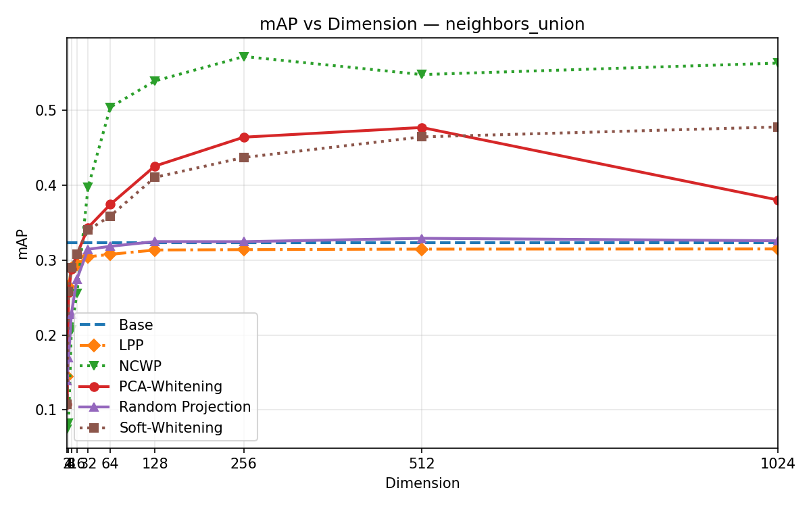
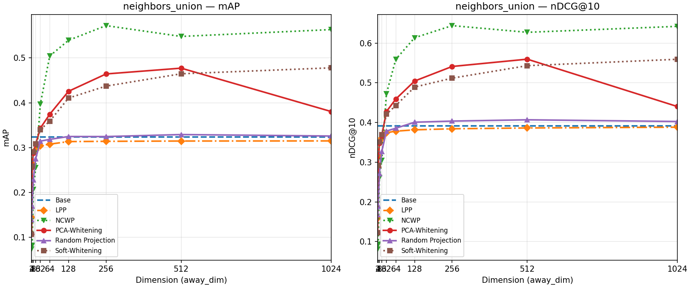
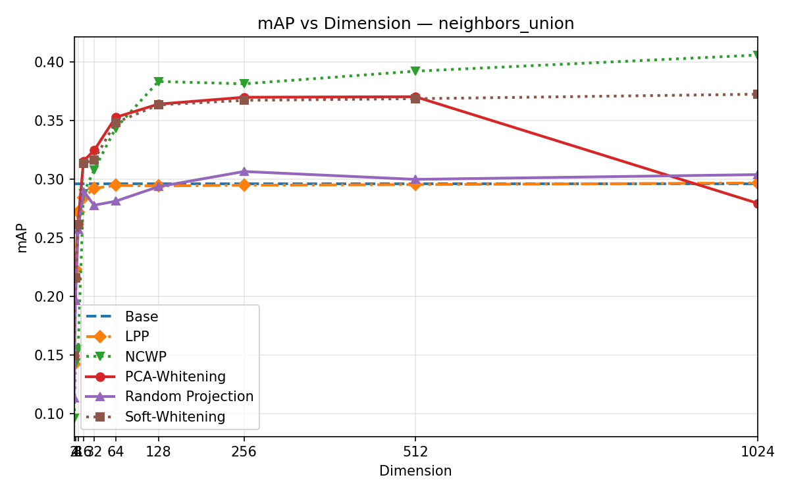
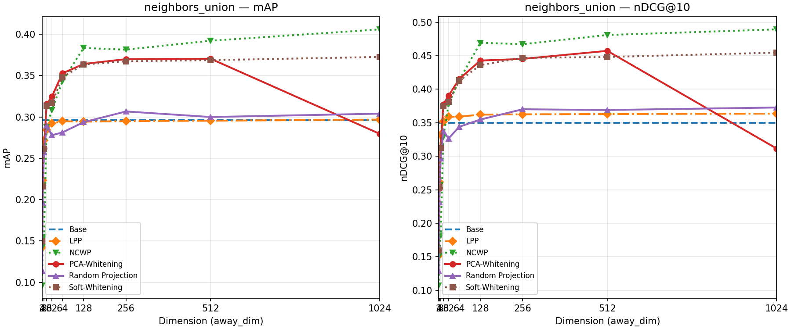

# NCWP: Neighbour-contrastive whitening projection

This repository implements the full NCWP pipeline: from corpus labeling to decoder-only model training, and finally to NCWP (PCA-whitening) evaluation.

**Note for Users:** To save your time, we provide pre-computed artifacts for every step. You can jump directly to the evaluation or analysis steps without running the heavy computations yourself.

---

## 0. Setup (Docker Recommended)

We strongly recommend using Docker to ensure a consistent environment.

### Build & Run
```bash
# 1. Build the image
docker build -t ncwp .

# 2. Run the container (interactive mode with GPU support)
docker run -it --rm --gpus all \
  -v "$(pwd)":/workspace/NCWP \
  -w /workspace \
  -p 8888:8888 \
  ncwp bash
```

*Alternatively, you can use a local Python environment (`pip install -r requirements.txt`), but Docker is preferred.*

---

## 1. Label Generation

We generate ground truth neighbors for the corpus. This project supports two types of labeling: **Embedding-based** (using large models) and **Traditional** (TF-IDF/BM25).

> **⚡ Time-Saving Note:** 
> The file **`labeled_corpus1000.csv`** provided in this repo **ALREADY CONTAINS BOTH** label types.
> - **Embedding-based labels:** `nvidia/llama-embed-nemotron-8b`, `qwen3-4b`, `neighbors_union`
> - **Traditional labels:** `tf_idf_tops`, `jaccard_tops`, `bm25_tops`
>
> You do **not** need to run the commands below unless you want to reproduce the process.

### A. Embedding-based Labels (Recommended for NCWP)
Uses large teacher models to find semantic neighbors.
*(Warning: Requires significant GPU memory)*

```bash
python -m label_generation.code.cli \
  --input corpus1000.csv \
  --output labeled_corpus1000.csv \
  --threshold 0.80 \
  --models llama qwen4b qwen8b
```

### B. Traditional Metrics (TF‑IDF / Jaccard / BM25)
Generates lexical overlap-based neighbors.

```bash
python -m traditional_labeling.code.cli \
  --input ./corpus1000.csv \
  --output ./labeled_corpus1000.csv \
  --tfidf-thr 0.40 --jaccard-thr 0.30 --bm25-percentile 90 --max-top 12
```
Output adds columns: `tf_idf_tops`, `jaccard_tops`, `bm25_tops`, `overlap2`, `overlap3`.

---

## 2. Decoder-Only Model Training

We train simple GPT-style models at various embedding dimensions (e.g., 2, 4, ..., 2048).

> **⚡ Time-Saving Note:** 
> Pre-trained weights are provided via Google Drive.
>
> **[Download Weights Here](https://drive.google.com/drive/folders/1bzoBFhG_S1Otz2_eok7xTm4VZK9Oqmgu?usp=sharing)**
>
> Please download the folders (`ws`, `bpe`, `wordpiece`) and place them inside the `weights/` directory:
> ```
> NCWP/
>   weights/
>     ws/
>     bpe/
>     wordpiece/
> ```
> Both **best** (lowest val loss) and **last** checkpoints are available.

### How to Run (Optional)
To train your own models (e.g., using BPE tokenizer):
```bash
python -m decoder_lm.code.cli_train \
  --input labeled_corpus1000.csv \
  --save-dir weights \
  --tok-type bpe \
  --dims 128 256 512 \
  --steps 500
```

### Output Artifacts
- `weights/bpe/base_dim_512.pt` (Model weights)
- `weights/bpe/vocab.json` (Tokenizer vocabulary)
- `weights/bpe/loss_dim_512.png` (Training loss curve)

<details>
<summary><strong>💡 Advanced Training Options (Click to expand)</strong></summary>

You can customize training with various flags. Here are common recipes:

**1. Train specific dimensions:**
```bash
python -m decoder_lm.code.cli_train \
  --input ./labeled_corpus1000.csv \
  --save-dir ./weights \
  --dims 2 4 8 16 32 64 128 256 512 1024 2048 \
  --steps 500
```

**2. Select tokenizer (ws | bpe | wordpiece) and auto-create subdirs:**
```bash
python -m decoder_lm.code.cli_train \
  --input ./labeled_corpus1000.csv \
  --save-dir ./weights \
  --use-tokenizer-subdir \
  --tok-type bpe \
  --dims 128 256 512 \
  --steps 500
```

**3. Custom save path template:**
```bash
python -m decoder_lm.code.cli_train \
  --input ./labeled_corpus1000.csv \
  --save-dir ./weights \
  --save-dir-template "{base}/{tok}" \
  --tok-type wordpiece \
  --dims 128 256 512 \
  --steps 500
```

**4. Early stopping & Longer training:**
```bash
python -m decoder_lm.code.cli_train \
  --input ./labeled_corpus1000.csv \
  --save-dir ./weights \
  --tok-type ws \
  --dims 128 256 512 \
  --steps 1000 \
  --eval-every 100 \
  --patience 7
```

**5. Train all 3 tokenizers with intermediate checkpoints (Loop):**
```bash
for TOK in ws bpe wordpiece; do
  python -m decoder_lm.code.cli_train \
    --input ./labeled_corpus1000.csv \
    --save-dir ./weights \
    --save-dir-template "{base}/{tok}" \
    --tok-type ${TOK} \
    --dims 128 256 512 \
    --steps 500 \
    --eval-every 100 \
    --patience 7 \
    --save-iter-interval 100
done
```
</details>

---

## 3. NCWP Evaluation (The Core Step)

This step evaluates how well our models (Base) and the NCWP method (PCA-whitening) approximate the Ground Truth neighbors.

> **⚡ Ready to Explore:** 
> Since weights and labels are ready, you can run this immediately to see the results!

### How to Run
Evaluate a specific base dimension (e.g., 512) against target dimensions:

```bash
python -m ncwp_eval.code.cli_ncwp \
  --corpus labeled_corpus1000.csv \
  --weights-dir weights/ws \
  --base-dim 512 \
  --dims 4 8 16 32 64 128 256 \
  --out-dir ncwp_results/demo_run \
  --show-plots \
  --progress-bar
```

<details>
<summary><strong>💡 Advanced Evaluation Options (Click to expand)</strong></summary>

You can run more complex evaluations, such as sweeps over checkpoints or automatic dimension generation.

**1. Basic Evaluation with Specific Tokenizer:**
```bash
# Set your tokenizer: ws | bpe | wordpiece
TOK=wordpiece

python -m ncwp_eval.code.cli_ncwp \
  --corpus ./labeled_corpus1000.csv \
  --weights-dir ./weights/${TOK} \
  --base-dim 512 \
  --dims 4 8 16 32 64 128 256 \
  --out-dir ./ncwp_results/${TOK}
```

**2. Auto-generate target dimensions (half_range):**
*Generates powers of two up to base_dim/2 (e.g., 2, 4, ..., 256 for base 512)*
```bash
python -m ncwp_eval.code.cli_ncwp \
  --corpus ./labeled_corpus1000.csv \
  --weights-dir ./weights/${TOK} \
  --base-dim 512 \
  --out-dir ./ncwp_results/${TOK}_half \
  --dims-auto-mode half_range
```

**3. Save Projectors & Show Progress:**
*Useful for saving the learned PCA matrices and visualizing in Jupyter.*
```bash
python -m ncwp_eval.code.cli_ncwp \
  --corpus ./labeled_corpus1000.csv \
  --weights-dir ./weights/${TOK} \
  --base-dim 512 \
  --dims 4 8 16 32 64 128 256 \
  --out-dir ./ncwp_results/${TOK} \
  --save-projectors \
  --show-plots \
  --progress-bar
```

**4. Sweep Modes (Evaluate multiple models at once):**

*   `--weights-mode best_only` (Default): Only best model for base-dim.
*   `--weights-mode checkpoints`: All checkpoints (step_*, last, best) for base-dim.
*   `--weights-mode base-dims`: All base dimensions found in the directory.

**Example: Evaluate all checkpoints for base-dim 1024**
```bash
python -m ncwp_eval.code.cli_ncwp \
  --corpus ./labeled_corpus1000.csv \
  --weights-dir ./weights/${TOK} \
  --base-dim 1024 \
  --dims-auto-mode half_range \
  --out-dir ./ncwp_results/${TOK}_ckpts1024 \
  --weights-mode checkpoints \
  --save-projectors
```

**Example: Evaluate ALL trained base dimensions in the folder**
```bash
python -m ncwp_eval.code.cli_ncwp \
  --corpus ./labeled_corpus1000.csv \
  --weights-dir ./weights/${TOK} \
  --dims-auto-mode half_range \
  --out-dir ./ncwp_results/${TOK}_alldims \
  --weights-mode base-dims \
  --save-projectors
```
</details>

### Expected Results

The tool generates a `comparison.csv` and visualization plots showing Mean Average Precision (mAP).

#### 1. Performance on Whitespace Tokenizer (Base Dim: 2048)

**mAP vs Dimension:**
*(Comparison of Base model training vs. NCWP projection. Note how NCWP (orange) maintains high performance even when projected down to very low dimensions like 32 or 64, whereas the Base model (blue) drops significantly.)*



**Detailed Metrics Panel:**
*(Breakdown of Precision, Recall, and mAP at different k-retrieval settings for the Whitespace tokenizer model.)*



#### 2. Performance on BPE Tokenizer (Base Dim: 2048)

**mAP vs Dimension:**
*(The same trend is observed with BPE tokenization. NCWP consistently outperforms training small models from scratch.)*



**Detailed Metrics Panel:**
*(Detailed metrics for the BPE tokenizer model.)*



---

## 4. Analysis & Visualization
